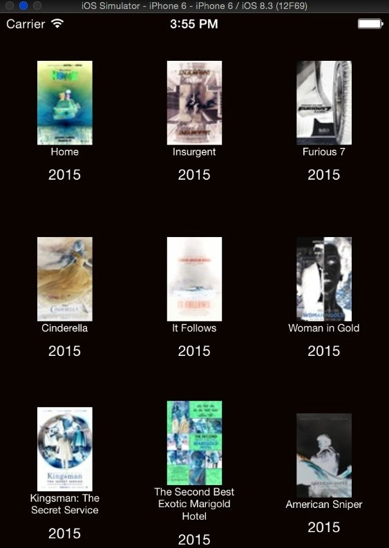

# react-native-grid-view

This component allows to display a grid/collection of items with more than one item per row. The items per row is configurable and it uses a 'ListView' in order to have a proper recycle mechanism.

## Getting started

1. `npm install react-native-grid-view`

## See Example

See `examples/` directory